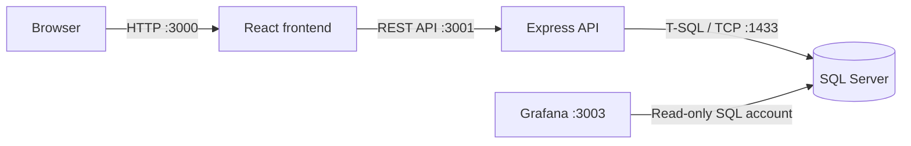

# F1 Garage Manager

<p align="center">
  
</p>

<p align="center">
  A collaborative Formula 1 garage management system built around relational data,
  role-based workflows, race simulation, and operational dashboards.
</p>

## Project Overview

F1 Garage Manager is a full-stack academic project that models the work of a Formula 1 garage. It combines a React interface, an Express API, a SQL Server database, and Grafana dashboards in one system.

The project demonstrates database design, stored procedures, transactional business rules, API integration, session-based authentication, and data visualization. All teams, people, and operational data included for demonstration are fictional.

## Main Features

- Role-based accounts and permissions for administrators, engineers, and drivers.
- Team, sponsor, car, driver, component, and inventory management.
- Car setup management for aerodynamic, suspension, and power-unit parameters.
- Race simulation with circuit data, car setup snapshots, performance calculations, ranking, and historical results.
- Budget and operational reporting through SQL views.
- Provisioned Grafana dashboard for simulation analysis.

## Architecture



The browser communicates with the backend through a configurable API URL. The backend owns authentication, authorization, validation, and database operations. SQL Server stores the domain model and implements core operations through procedures, triggers, and views. Grafana reads reporting views using a separate read-only account.

## Tech Stack

| Layer | Technologies |
| --- | --- |
| Frontend | React 19, React Router, Axios, Tailwind CSS, Framer Motion |
| Backend | Node.js, Express, express-session, Argon2, Winston |
| Database | Microsoft SQL Server, T-SQL, stored procedures, triggers, views |
| Monitoring | Grafana, provisioned MSSQL datasource and dashboard |
| Tooling | npm, PowerShell, sqlcmd, Docker Compose |

## Project Structure

```text
F1-Garage-Manager/
├── backend/                 Express API, services, routes, tests, and scripts
├── database/
│   ├── schemas/             Relational schema
│   ├── procedures/          Domain operations and authentication
│   ├── triggers/            Database automation
│   ├── views/               Application and reporting views
│   ├── seeds/               Optional fictional demo data
│   └── setup.ps1            Ordered database installer
├── frontend/                React application
├── grafana/                 Compose, datasource, and dashboard provisioning
└── docs/                    Academic design material
```

## Prerequisites

- Windows PowerShell 5.1 or PowerShell 7.
- Node.js 18 LTS and npm. The current dependency set targets Node 18.
- Microsoft SQL Server 2019 or newer.
- Microsoft `sqlcmd` command-line tools.
- Docker Desktop with Docker Compose, only when running Grafana.

SQL Server must accept the connection method you choose. The commands below use Windows authentication for database installation and a SQL login for the application.

## Database

### Automated installation

Run the installer from the repository root. It creates the database when needed and applies the scripts in their tested dependency order.

```powershell
$env:F1_SETUP_APP_PASSWORD = 'choose-a-local-password'
./database/setup.ps1 `
  -Server localhost `
  -Database f1_garage_tec `
  -AppUser f1_app_user `
  -SeedDemo
```

The setup script deliberately stops if the target database already contains tables. This protects an existing installation from being overwritten. Use a new empty database for a clean setup.

The default connection uses Windows authentication. To install with SQL Server authentication, add `-User <setup-user> -Password <setup-password>`.

After setup, remove the temporary PowerShell variable if it still exists:

```powershell
Remove-Item Env:F1_SETUP_APP_PASSWORD -ErrorAction SilentlyContinue
```

### SQL script order

The installer is the supported setup path. For reference, it runs:

1. `schemas/schema.sql`
2. `procedures/users.sql`
3. `procedures/teams.sql`
4. `procedures/sponsors.sql`
5. `procedures/parts-inventory.sql`
6. `procedures/cars.sql`
7. `procedures/circuits.sql`
8. `procedures/simulation.sql`
9. `triggers/trg_crear_conductor.sql`
10. `views/vw_presupuesto_equipo.sql`
11. `views/grafana_views.sql`
12. `seeds/demo.sql`, when `-SeedDemo` is selected

The optional seed is idempotent and contains fictional demonstration records. It does not create application accounts.

## Setup / Installation

### 1. Clone and install packages

```powershell
git clone https://github.com/brema026/F1-Garage-Manager.git
cd F1-Garage-Manager

cd backend
npm ci
cd ../frontend
npm ci
cd ..
```

### 2. Initialize SQL Server

Run the [database setup](#database), using a local application password and an empty database.

### 3. Configure the backend

```powershell
Copy-Item backend/.env.example backend/.env
```

Edit `backend/.env`. Set `DB_USER` to the `AppUser` created during database setup and use the same local password.

Create the first administrator once:

```powershell
cd backend
npm run bootstrap-admin
npm run test-db
cd ..
```

The bootstrap command reads `BOOTSTRAP_ADMIN_NAME`, `BOOTSTRAP_ADMIN_EMAIL`, and `BOOTSTRAP_ADMIN_PASSWORD` from `backend/.env`. Remove those three values from the file after the administrator is created.

### 4. Configure the frontend

```powershell
Copy-Item frontend/.env.example frontend/.env
```

The defaults point to the local backend and provisioned Grafana dashboard. Change them only if you use different hosts or ports.

## Environment Variables

### Backend: `backend/.env`

| Variable | Purpose | Local example |
| --- | --- | --- |
| `NODE_ENV` | Runtime mode | `development` |
| `PORT` | API port | `3001` |
| `FRONTEND_PORT` | Development frontend port | `3000` |
| `FRONTEND_ORIGINS` | Comma-separated allowed origins | `http://localhost:3000,http://127.0.0.1:3000` |
| `DB_SERVER`, `DB_PORT` | SQL Server endpoint | `localhost`, `1433` |
| `DB_NAME` | Database name | `f1_garage_tec` |
| `DB_USER`, `DB_PASSWORD` | Application SQL login | Local values |
| `DB_ENCRYPT` | Encrypt SQL connection | `true` |
| `DB_TRUST_SERVER_CERTIFICATE` | Trust a local self-signed certificate | `true` locally |
| `SESSION_TIMEOUT` | Session lifetime in milliseconds | `3600000` |
| `LOG_LEVEL` | Winston logging level | `info` |

The `BOOTSTRAP_ADMIN_*` values are temporary inputs for the first administrator and should be removed after use.

### Frontend: `frontend/.env`

| Variable | Purpose | Default |
| --- | --- | --- |
| `PORT` | React development server | `3000` |
| `REACT_APP_API_URL` | Backend API base URL | `http://localhost:3001/api` |
| `REACT_APP_GRAFANA_URL` | Dashboard URL opened by the UI | `http://localhost:3003/d/f1-garage` |

### Grafana: `grafana/.env`

Copy `grafana/.env.example` and provide the local Grafana admin values plus a dedicated read-only SQL login. Do not commit any `.env` file.

## Running the Application

Start the backend:

```powershell
cd backend
npm start
```

In a second terminal, start the frontend:

```powershell
cd frontend
npm start
```

Open `http://localhost:3000` and sign in with the administrator created during setup.

| Service | Local address |
| --- | --- |
| Frontend | `http://localhost:3000` |
| Backend API | `http://localhost:3001/api` |
| Backend health check | `http://localhost:3001/api/health` |
| SQL Server | `localhost:1433` |
| Grafana | `http://localhost:3003` |

## Grafana / Monitoring

Create a dedicated SQL login with read access to `f1_garage_tec`. The Grafana account does not need write access or procedure execution.

```sql
USE [master];
CREATE LOGIN [f1_grafana_reader] WITH PASSWORD = 'choose-a-local-password', CHECK_POLICY = ON;
USE [f1_garage_tec];
CREATE USER [f1_grafana_reader] FOR LOGIN [f1_grafana_reader];
ALTER ROLE [db_datareader] ADD MEMBER [f1_grafana_reader];
```

Then start the provisioned instance:

```powershell
Copy-Item grafana/.env.example grafana/.env
# Edit grafana/.env with the read-only login and local Grafana admin values.
docker compose --env-file grafana/.env -f grafana/docker-compose.grafana.yml up -d
```

Grafana is bound to loopback at `http://localhost:3003`. Compose provisions the MSSQL datasource and the **F1 Garage — Race Simulation** dashboard automatically. If SQL Server is on another host, set `GRAFANA_DB_HOST` accordingly and allow only the required network path.

## Testing

```powershell
cd backend
npm test
npm run test-db

cd ../frontend
npm run build
```

`npm run test-db` requires a configured `backend/.env` and verifies the active database connection. The frontend build may report dependency deprecation warnings from Create React App; these do not prevent the build.

## Validation Status

The documented setup was validated on a clean, isolated SQL Server database. Validation included every schema, procedure, trigger, and view; the optional seed; application-login creation; first-admin bootstrap; the backend database check; and live health, login, and authenticated profile requests. All 25 backend tests passed, and the frontend production build completed successfully with existing lint warnings.

Docker was unavailable in the validation environment. The Grafana Compose configuration, provisioning files, and dashboard JSON were validated statically, while a live Grafana-to-SQL Server connection remains an environment-specific verification step.

## Contributors

- Ian Yoel Gómez Oses
- Mauro Brenes Brenes
- Steven Aguilar Álvarez
- Sebastián Chaves Ruiz

## Academic Context

This collaborative project was developed for **CE-3101 — Database Systems** in the Computer Engineering program at **Tecnológico de Costa Rica**. It is presented as an engineering portfolio project and remains an academic system rather than a production Formula 1 service.

## License

This project is available under the [MIT License](LICENSE).
